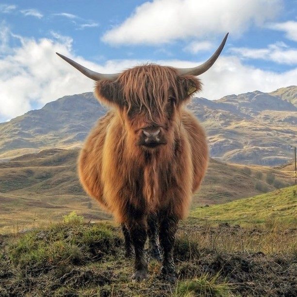
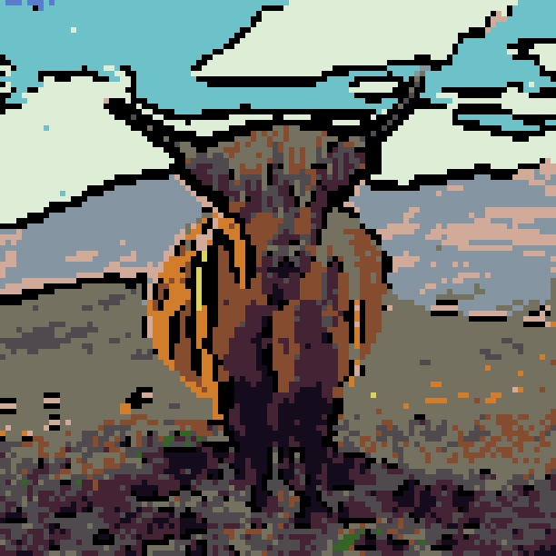
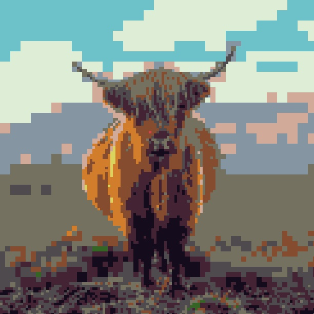
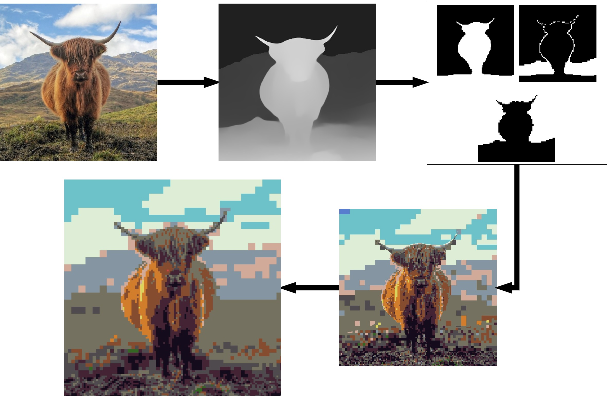
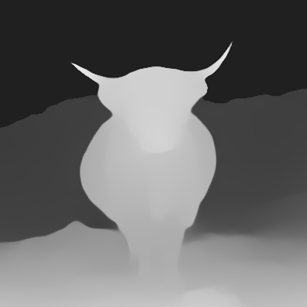
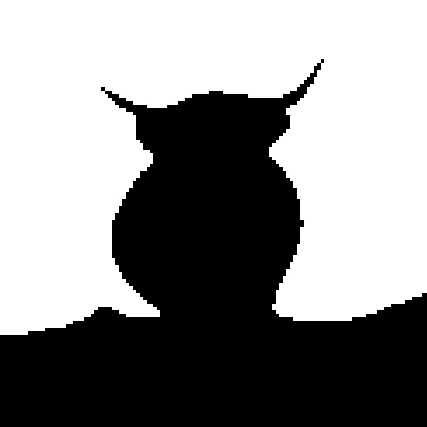
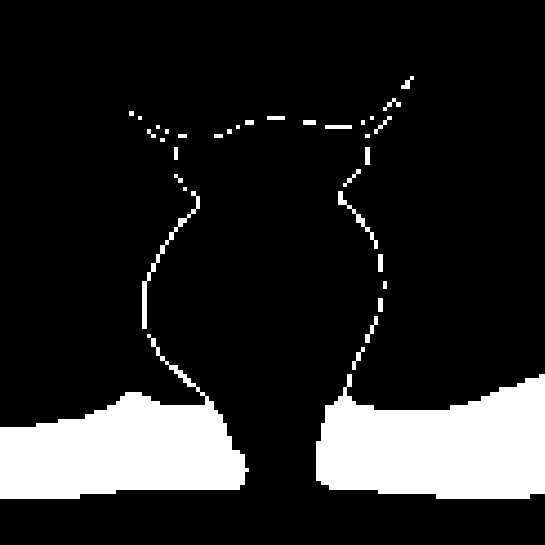
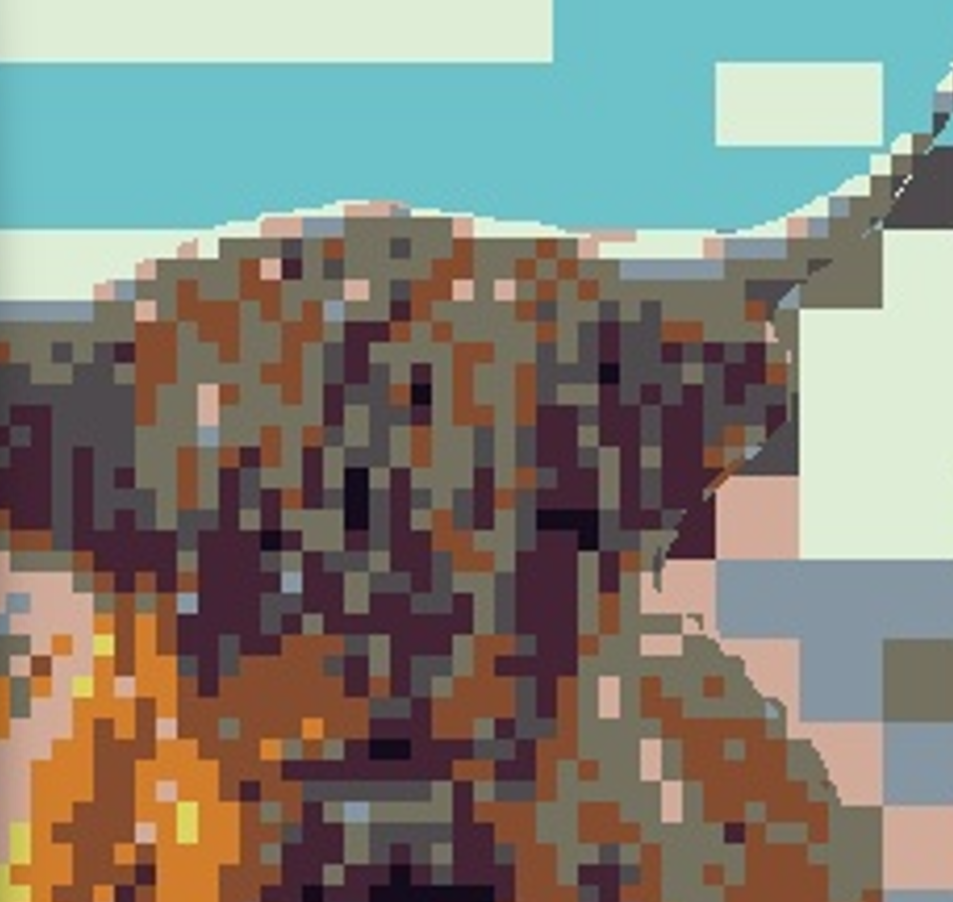
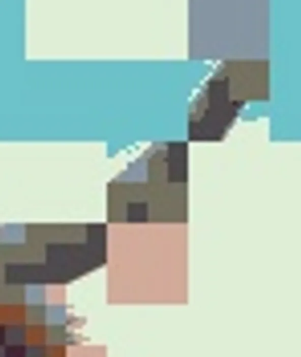
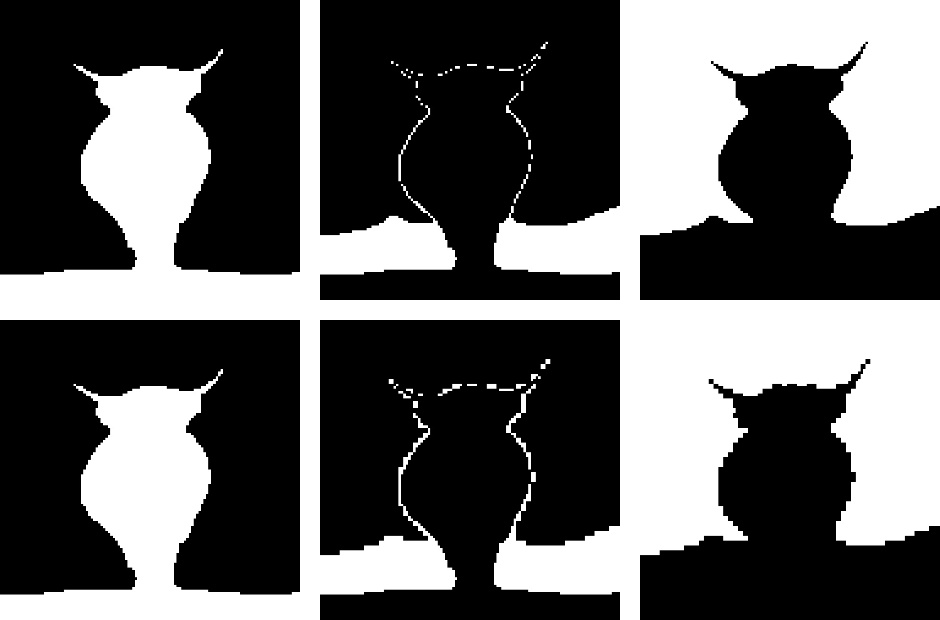

# Pixel-Art
 

    
    

This feature enables users to apply a pixel art effect to any image, leveraging classic image processing techniques to authentically replicate the distinctive style of this art form.  

## Key Features  

- **Classic Pixel Art Rendering** – Achieved through downsampling and k-nearest neighbors (KNN) search to create a simplified, pixelated representation of the original image.  
- **Adaptive Palette and Quantization** – Since pixel art typically utilizes a limited color palette, this feature extracts the most dominant colors from the image and reduces them to a refined, cohesive palette.  
- **Edge Detection and Enhancement** – Black outlines, a prominent feature of pixel art, are generated using edge detection techniques to either fully outline objects or emphasize key features.  
- **Real-Time Application** – The script can be adapted for real-time video processing, allowing pixel art effects to be applied dynamically to live video feeds.  

# Depth Based Pixel Art

    
    

**Pipeline**:

- For Depth Map Extraction [MiDas](https://github.com/isl-org/MiDaS) was used for
monocular depth estimation

- Image is then segmented into 3 layer Masks. 

    
    
    

- Further, grid-based segmentation ensures alignment with pixelation boundaries. 

(Left: Edges on simply merging masks; Right: Edges after specifically processing)

    
    

- Pixel size varies by depth. Each block’s average color is quantized to the closest palette color.
- Initial approach included merging layers sequentially, leading to possible artifacts and overlapping at depth boundaries.

- Merged masks in an edge-conscious way. The grid structure assigns blocks to depth layers and ensures clean, grid-aligned boundaries. Whole blocks are included in a mask if any pixel falls in that depth layer.

(Top row (from left): foreground, middleground, and background; Bottom row: After resolving mask conflict)

